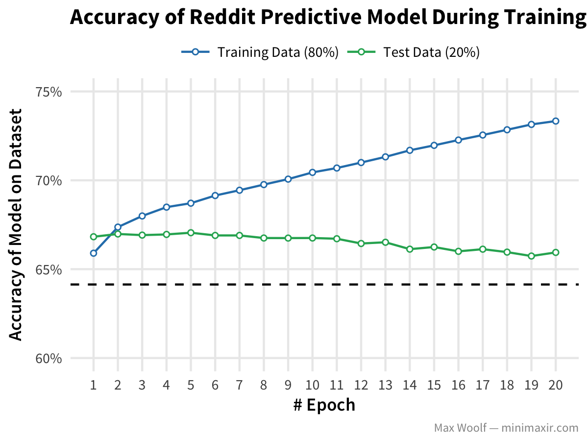

This R Notebook is the complement to my blog post [Predicting the Success of a Reddit Submission with Deep Learning and Keras](http://minimaxir.com/2017/06/reddit-submission-predict/).

This notebook is licensed under the MIT License. If you use the code or data visualization designs contained within this notebook, it would be greatly appreciated if proper attribution is given back to this notebook and/or myself. Thanks! :)

# Setup

```{r}
library(readr)
library(dplyr)
library(ggplot2)
library(scales)
library(tidyr)
library(tsne)
library(viridis)

sessionInfo()
```

Load data.

```{r}
df_training <- read_csv("training.csv")
df_dayofweeks <- read_delim("dayofweeks_embeddings.txt", col_names = F, delim=" ", quote = "—")
df_dayofyears <- read_delim("dayofyears_embeddings.txt", col_names = F, delim=" ", quote = "—")
df_hours <- read_delim("hours_embeddings.txt", col_names = F, delim=" ", quote = "—")
df_minutes <- read_delim("minutes_embeddings.txt", col_names = F, delim=" ", quote = "—")
```

## Plot Model Training

```{r}
# Test Accuracy must be better than this.
no_information_rate <- 0.64137998126
```

Tidy dataframe to plot Training Accuracy vs. Test Accuracy

```{r}
df_training_tf <- df_training %>%
                    mutate(epoch = epoch + 1) %>%
                    gather(type, perc, main_out_acc, val_main_out_acc)

plot <- ggplot(df_training_tf, aes(epoch, perc, color=type)) +
          geom_line() +
          geom_point(size=1, fill="white", shape=21) +
          geom_hline(yintercept=no_information_rate) +
          scale_x_continuous(breaks=seq(1,20)) +
          scale_y_continuous(labels=percent, limits=c(0.60, 0.75)) +
          scale_color_manual(values=c("#2980b9", "#27ae60"), labels=c("Training Data (80%)", "Test Data (20%)")) +
          labs(title = "Accuracy of Reddit Predictive Model During Training",
               x = "# Epoch",
               y = "Accuracy of Model on Dataset",
               caption = "Max Woolf — minimaxir.com",
               color='') + 
          theme_minimal(base_size=9, base_family="Source Sans Pro") +
            theme(plot.title = element_text(size=11, family="Source Sans Pro Bold"),
                  axis.title.x = element_text(family="Source Sans Pro Semibold"),
                  axis.title.y = element_text(family="Source Sans Pro Semibold"),
                  plot.caption = element_text(size=6, color="#969696"),
                  legend.position="top", legend.margin=margin(t = -0.1, b = -0.25, unit='cm'),
                  panel.grid.minor = element_blank())

ggsave("predict-reddit-1.png", plot, width=4, height=3)
```



## Plot Embeddings

## Day of Week

```{r}
perplexity = 0
initial_dims = 64
max_iter = 500

set.seed(123)

df_dayofweeks_tf <- df_dayofweeks %>% select(X2:X65)%>%
                  data.matrix() %>%
                  tsne(perplexity = perplexity, initial_dims = initial_dims, max_iter = max_iter)

df_dayofweeks_tf <- data.frame(dayofweek = c("Sunday","Monday","Tuesday","Wednesday","Thursday","Friday","Saturday"), df_dayofweeks_tf) %>%
                    tbl_df()

df_dayofweeks_tf
```

```{r}
plot <- ggplot(df_dayofweeks_tf, aes(x=X1, y=X2, label=dayofweek, color =dayofweek)) +
          geom_text(family="Source Code Pro Semibold") +
          theme_void(base_family = "Source Sans Pro", base_size=8) +
          scale_color_viridis(discrete=T, guide=FALSE) + 
          scale_x_continuous(limits=c(-3000,3000)) +
          labs(title = "2D Projection of Day-of-Week Vectors in Reddit Prediction Model",
               subtitle = "Labels closer to each other are more similar in context.",
               caption = "Max Woolf — minimaxir.com") +
          theme(plot.margin = unit(c(0.2,0.2,0.2,0.2),"cm"),
                plot.caption = element_text(size=6, color="#969696"))
          
ggsave("predict-reddit-2.png", plot, width=4, height=3)
```

## Day of Year

```{r}
perplexity = 30
initial_dims = 64
max_iter = 1000

set.seed(123)

labels <- c(paste0("J", 1:31),paste0("F", 1:28), paste0("M", 1:30), paste0("A", 1:31))

df_dayofyears_tf <- df_dayofyears[1:120,] %>% select(X2:X65)%>%
                  data.matrix() %>%
                  tsne(perplexity = perplexity, initial_dims = initial_dims, max_iter = max_iter)

df_dayofyears_tf <- data.frame(labels, df_dayofyears_tf) %>%
                    tbl_df()

df_dayofyears_tf
```


```{r}
xscale = 200
yscale = 200

plot <- ggplot(df_dayofyears_tf, aes(x=X1, y=X2, label=labels, color = labels)) +
          geom_text(family="Source Code Pro Semibold", alpha=0.8, size=3) +
          theme_void(base_family = "Source Sans Pro", base_size=8) +
          scale_color_viridis(discrete=T, guide=FALSE) + 
          #scale_x_continuous(limits=c(-xscale, xscale)) +
          #scale_y_continuous(limits=c(-yscale, yscale)) +
          labs(title = "2D Projection of Day-of-Year Vectors in Reddit Prediction Model",
               subtitle = "Labels closer to each other are more similar in context.",
               caption = "Max Woolf — minimaxir.com") +
          theme(plot.margin = unit(c(0.2,0.2,0.2,0.2),"cm"),
                plot.caption = element_text(size=6, color="#969696"))
          
ggsave("predict-reddit-3.png", plot, width=4, height=3)
```